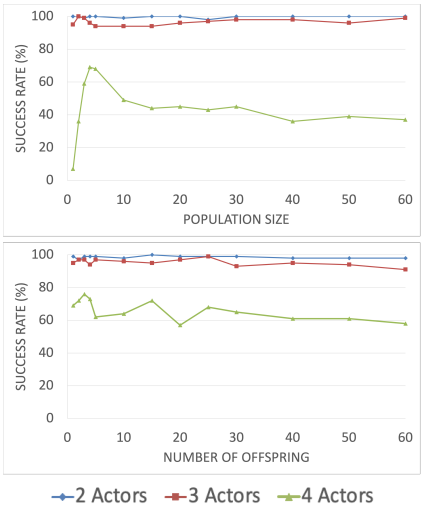
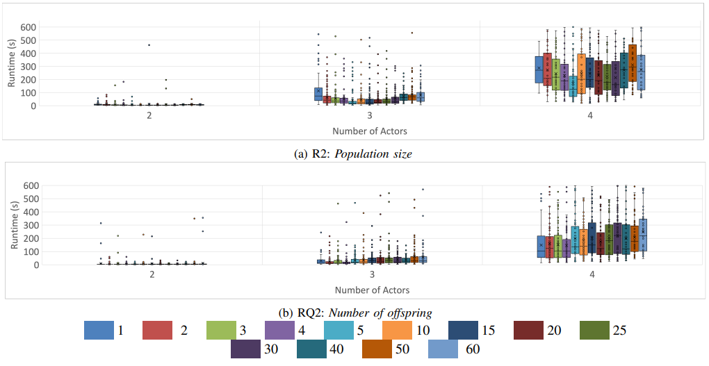

# Hyperparameter Tuning of NSGA-II for Traffic Scene Generation

## Overview
This repository contains code developed as part of my honours research at McGill University, focused on evaluating how hyperparameter choices impact the performance of a multi-objective evolutionary algorithm (NSGA-II).

The project investigates a constrained optimization problem in autonomous vehicle traffic scene generation, where the goal is to find configurations that satisfy complex geometric constraints.

## My Contribution
My work focused on designing and conducting experiments to evaluate how different hyperparameter settings affect algorithm performance. Specifically, I:

- Designed experiments varying population size and number of offspring  
- Ran multiple trials across randomly generated scenarios  
- Collected and analyzed results in terms of success rate and runtime  
- Applied statistical tests (Fisher’s exact test, Mann–Whitney U test) to assess significance of performance differences  
- Identified effective parameter configurations based on empirical results  

## Repository Structure
- `scripts/` – Python scripts used to run experiments and collect results  
- `analysis/` – Scripts or notebooks used for analyzing experimental results  
- `results/` – Sample output data (e.g., logs, CSVs, or summaries of runs)  

## Notes on Reproducibility
The full experimental setup depends on a research environment and external tools (e.g., NSGA-II implementation and simulation frameworks), so the code may not run directly without additional configuration.

This repository is intended to demonstrate:
- experiment design  
- data collection workflows  
- statistical analysis of results  

## Results

### Success Rate wrt. Population Size and Number of Offspring

### Runtime wrt. Population Size and Number of Offspring

The results, supported by statistical significance measurments, show that 5 is the optimal setting of population size for concrete scene generation. Number of offspring performed best with values of 3 or 4, however the performance benefits over other settings was limited. Overall, population size is more influential than number of offspring on the performance of concrete scene generation.

## Technologies Used
- Python    
- Statistical testing (Fisher’s exact test, Mann–Whitney U test)  

## Related Work
This repository is based on my honours research project, which resulted in a co-authored paper evaluating hyperparameter tuning for NSGA-II in traffic scene generation.
